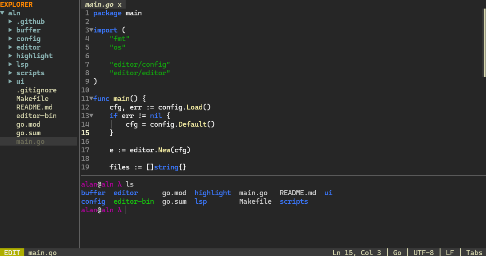
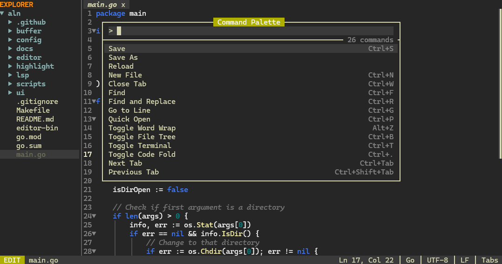
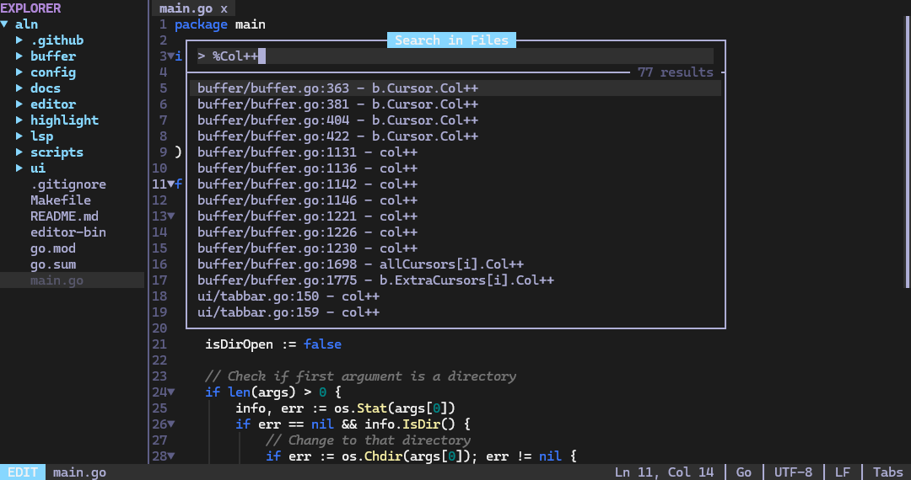

# ALN

<p align="center">
  
</p>

<p align="center">
  A terminal-first code editor that feels lightweight, modern, and dependable.
</p>

<p align="center">
  <a href="https://github.com/daisied/aln/releases">Releases</a> ·
  <a href="#quick-setup">Quick Setup</a> ·
  <a href="#keybindings">Keybindings</a>
</p>

---

## Quick setup

```bash
curl -fsSL https://raw.githubusercontent.com/daisied/aln/main/scripts/install.sh | bash
```

That installs `aln` into `~/.local/bin` and helps add it to your PATH.

---

## Why ALN

If you like editing in the terminal but still want modern tooling, ALN sits in a nice middle ground:

- **Faster and richer than basic terminal editors**
- **Less ceremony than modal workflows**
- **More focused than heavyweight GUI IDEs**

It is built for people living in shells, SSH sessions, tmux, and remote boxes.

---

## Screenshots

<p align="center">
  
</p>

<p align="center">
  
</p>

<p align="center">
  
</p>

---

## Features

### Editing
- Tabs + preview tabs
- Undo/redo
- Multi-cursor editing (`Ctrl+D`, vertical mouse multi-cursor)
- Auto-close pairs + quote wrapping
- Smart indentation on newline
- Duplicate/move lines, indent/dedent, comment toggle
- Word movement and word deletion
- Code folding by indentation
- Binary-file safe mode + large-file warnings
- Preserves encoding and line endings

### Navigation & search
- Quick Open (`Ctrl+P`) with fuzzy ranking
- Command Palette (`Ctrl+Shift+P` / `Ctrl+Space`)
- Project search inside palette with `%query`
- Find + find/replace (+ regex)
- Match navigation (`F3`, `Shift+F3`)
- Go to line (`Ctrl+G`)
- Jump to matching bracket (`Ctrl+]`)

### IDE features
- LSP completion popup
- Diagnostics (errors/warnings)
- Go to definition (`F12`)
- Rename symbol (`F2`)
- Syntax highlighting (Chroma)
- `.editorconfig` support

### UI & terminal
- File tree (open, create, rename, delete, refresh)
- PTY terminal with ANSI support
- Terminal scrollback + selection copy
- Alternate screen support (vim/htop/etc.)
- Mouse support throughout editor
- Theme + behavior settings dialog (`Alt+,`)

### Reliability
- External file change watching + reload flow
- Autosave crash recovery backups
- Session restore per working directory
- Clean shutdown of terminal + language servers

<details>
<summary><strong>Complete feature list (full detail)</strong></summary>

#### Editing depth
- Auto-close bracket/quote insertion and smart swallow behavior
- Selection wrapping with `'`, `"`, and `` ` ``
- Per-language indentation defaults (tabs/spaces + tab width)
- Multi-cursor insert/delete/movement across lines
- Selection-based copy/cut + line fallback behavior
- Fold discovery from indentation blocks

#### Search depth
- Fuzzy scored ranking in quick open + command palette
- Palette `%query` search uses `rg`; falls back to `grep`
- Incremental find state with next/prev navigation callbacks

#### LSP depth
- Auto-start known servers when available in PATH
- Diagnostics mapped per file URI
- Workspace rename edits applied across files
- Hover and completion protocol plumbing

#### Terminal depth
- ANSI/CSI/OSC parser
- Scrollback rendering + view offsets
- Alternate buffer support and cursor mode handling
- Bracketed paste support

#### Persistence depth
- Backups stored at `~/.local/share/aln/backups`
- Sessions stored at `~/.local/share/aln/sessions`
- Config stored at `~/.config/aln/settings.json`

</details>

---

## Installation

### 1) One-line installer (recommended)

```bash
curl -fsSL https://raw.githubusercontent.com/daisied/aln/main/scripts/install.sh | bash
```

Optional installer variables:
- `ALN_REPO` (default: `daisied/aln`)
- `ALN_VERSION` (default: latest)
- `ALN_INSTALL_DIR` (default: `~/.local/bin`)
- `ALN_BINARY_NAME` (default: `aln`)

### 2) Build from source

```bash
git clone https://github.com/daisied/aln.git
cd aln
make build
make install
```

### 3) Manual release install

1. Download the release binary for your OS/arch
2. `chmod +x aln`
3. Move to `~/.local/bin/aln`
4. Ensure `~/.local/bin` is in your PATH

---

## Usage

```bash
aln
aln .
aln path/to/file
aln path/to/directory
```

---

## Keybindings

### Core
- `Ctrl+S` save
- `Ctrl+Q` quit (press twice if unsaved)
- `Ctrl+H` / `F1` help
- `Alt+,` settings

### Files/tabs
- `Ctrl+N` new file
- `Ctrl+W` close tab
- `Ctrl+Tab` / `Ctrl+Shift+Tab` next/prev tab
- `Alt+1..9`, `Alt+0` jump to tab number

### Editing
- `Ctrl+Z` / `Ctrl+Shift+Z` undo/redo
- `Ctrl+C` / `Ctrl+X` / `Ctrl+V` copy/cut/paste
- `Ctrl+A` select all
- `Ctrl+D` select next occurrence (multi-cursor)
- `Ctrl+/` toggle comment
- `Alt+Up/Down` move line
- `Tab` / `Shift+Tab` indent/dedent
- `Ctrl+Backspace` / `Ctrl+Delete` delete word

### Navigation/search
- `Ctrl+F` find
- `Ctrl+R` find/replace
- `F3` / `Shift+F3` next/prev match
- `Ctrl+G` go to line
- `Ctrl+]` jump to bracket pair

### Panels
- `Ctrl+B` toggle file tree
- `Ctrl+E` tree/editor focus
- `Ctrl+T` toggle terminal
- `Ctrl+Shift+P` or `Ctrl+Space` command palette
- `Ctrl+.` toggle fold
- `Alt+Z` toggle word wrap

---

## Configuration

Settings file: `~/.config/aln/settings.json`

Configurable:
- Theme
- Space size
- Tree width
- Terminal ratio
- Word wrap
- Auto-close
- Quote-wrap selection
- Trim trailing whitespace
- Insert final newline

---

## LSP prerequisites (optional)

Install any you want to use:
- Go: `gopls`
- Python: `pyright-langserver`
- TypeScript/JavaScript: `typescript-language-server`
- Rust: `rust-analyzer`
- C/C++: `clangd`

---

## Development

```bash
make build
make install
make clean
go test ./...
```
